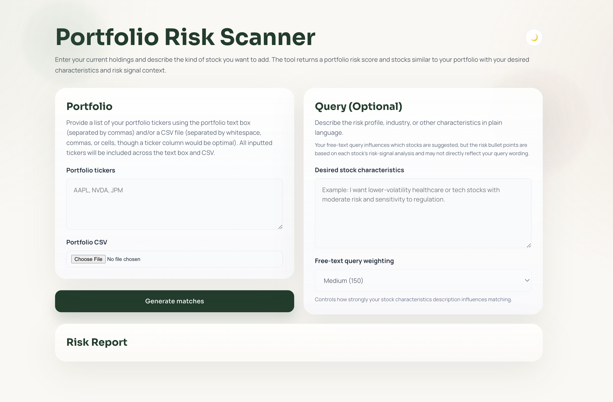
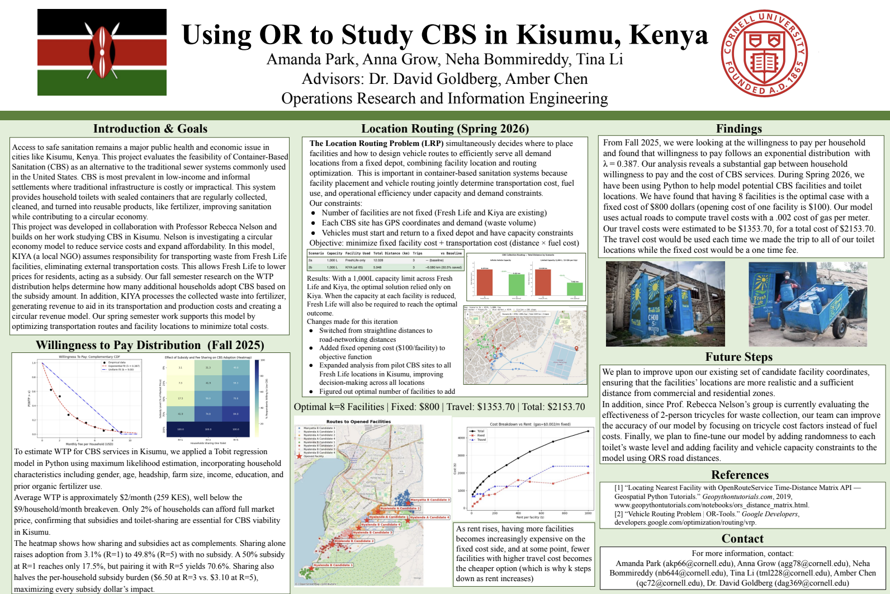
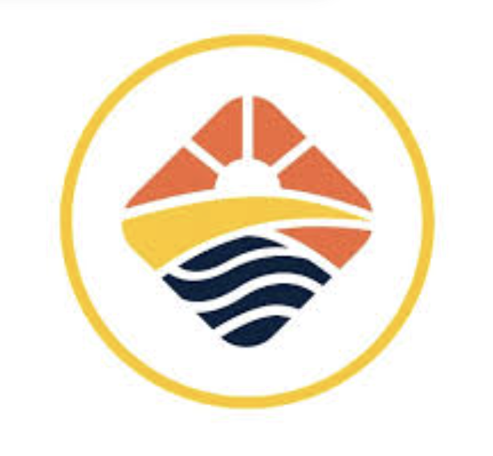

# Tina Li

ORIE student at Cornell University.

## About Me

  

    
  

  

    

      I am an Operations Research and Information Engineering student at Cornell University
      interested in data science, analytics, optimization, and engineering for social impact.
    

    

      I have experience in portfolio risk analysis, location-routing optimization, and
      infrastructure-focused engineering work through Cornell Engineers in Action.
    

  

## Experience
- Cboe Regulatory Intern (Incoming)
- Cornell Engineers in Action
- CBS Routing & Optimization Research

## Projects

  

    
    <h3>PortfolioRiskScanner</h3>
    
Risk-focused stock recommendation system using TF-IDF, SVD, sentiment, and news-based risk signals.

  

  

    
    <h3>CBS Location-Routing Research</h3>
    
Optimized facility locations and vehicle routes for container-based sanitation implementation in Kisumu, Kenya.

  

  

    
    <h3>Engineers in Action</h3>
    
Infrastructure-focused engineering work supporting pedestrian bridges and WASH systems in Eswatini.

  

  &times;
  

## Contact
- LinkedIn
- GitHub
- Email
