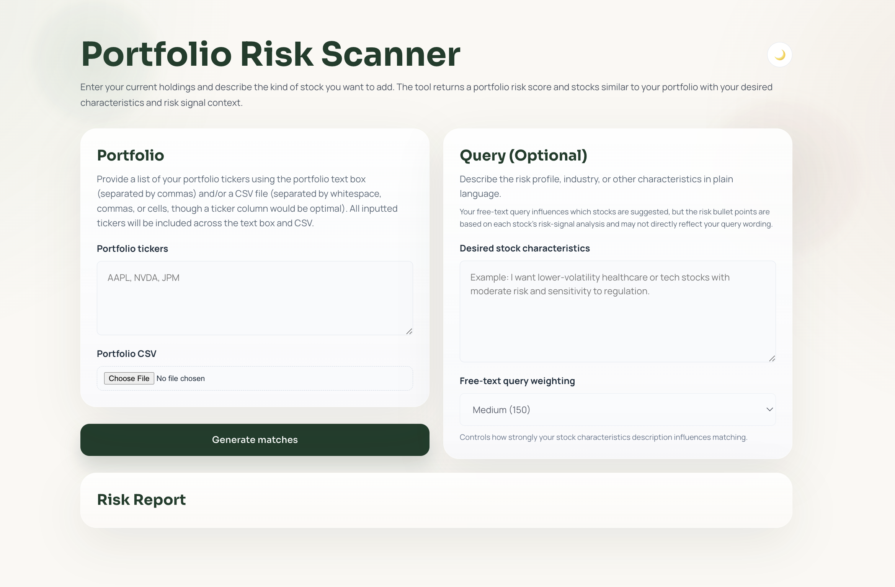
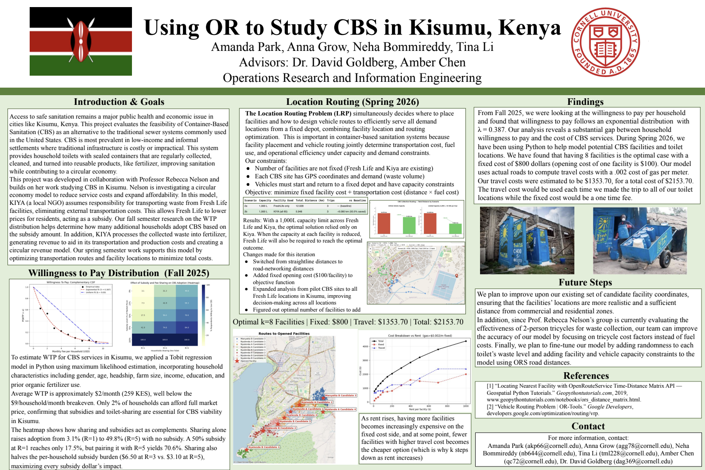
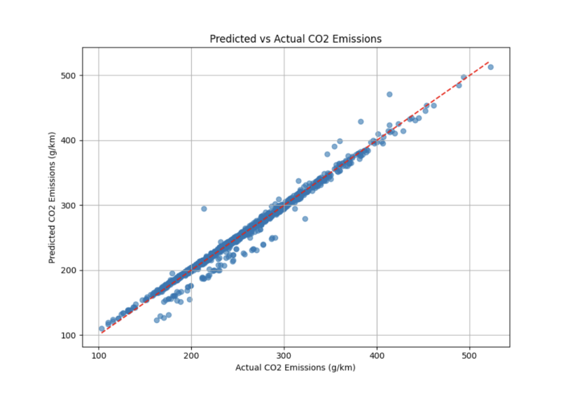
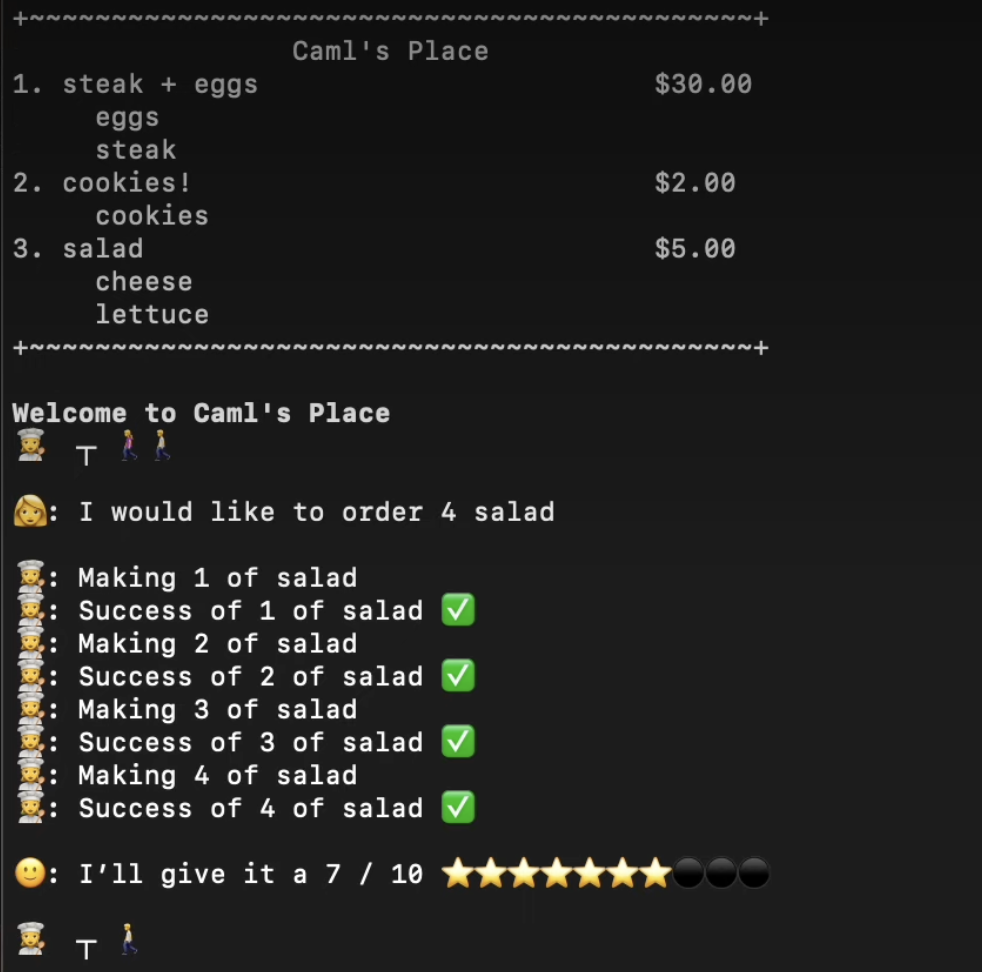

# About Me

  

    
  

  

    

      I am a driven and curious undergraduate student at Cornell University studying Operations Research and Information Engineering (ORIE)       and Computer Science with an expected graduation of December 2026. I am passionate about translating data into actionable insights,         as well as the intersection between data analytics and finance.
    

    

      If you asked the people closest to me, they would describe me as “their biggest hypeman.” I pride myself on showing genuine care            toward the people I work with and being a dependable person who’s always true to their word. Whether that means celebrating a               friend’s successes, or stepping up when no one else in the team can, I try to be someone others know they can count on.
    

  

## Experience
- Cboe Regulatory Intern (Incoming)
- Cornell Engineers in Action
- CBS Routing & Optimization Research

## Projects

  

    
    <h3>PortfolioRiskScanner</h3>
    
Risk-focused stock recommendation system using TF-IDF, SVD, sentiment, and news-based risk signals.

  

  

    
    <h3>CBS Location-Routing Research</h3>
    
Optimized facility locations and vehicle routes for container-based sanitation implementation in Kisumu, Kenya.

  

  

    
    <h3>Vehicle CO2 Emissions Analysis</h3>
    
Exploratory data analysis to determine key predictors of vehicle CO2 emissions.

  

  

    
    <h3>CamlChef</h3>
    
Interactive cooking game with customization and tracking features, coded using OCaml.

  

  &times;
  

## Contact

- [LinkedIn](https://www.linkedin.com/in/tina-m-li/)
- [GitHub](https://github.com/tml228)
- [Email](mailto:tinamyli@live.com)
